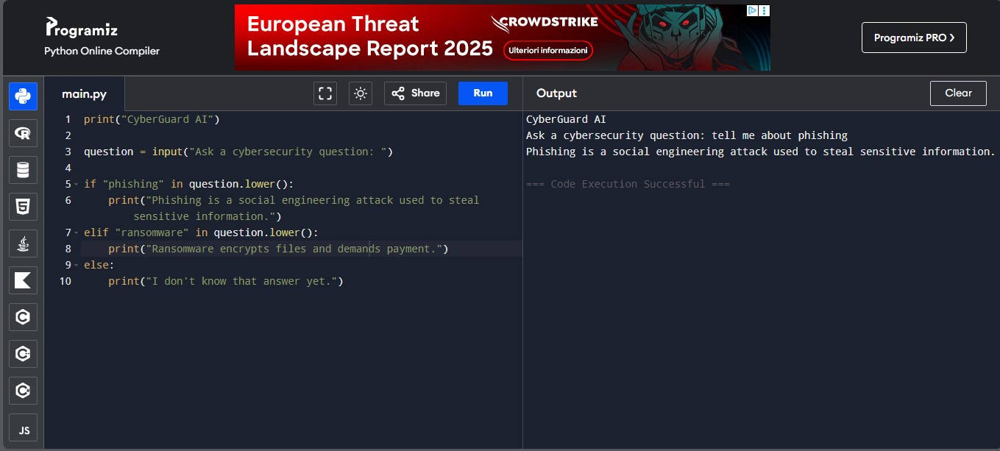
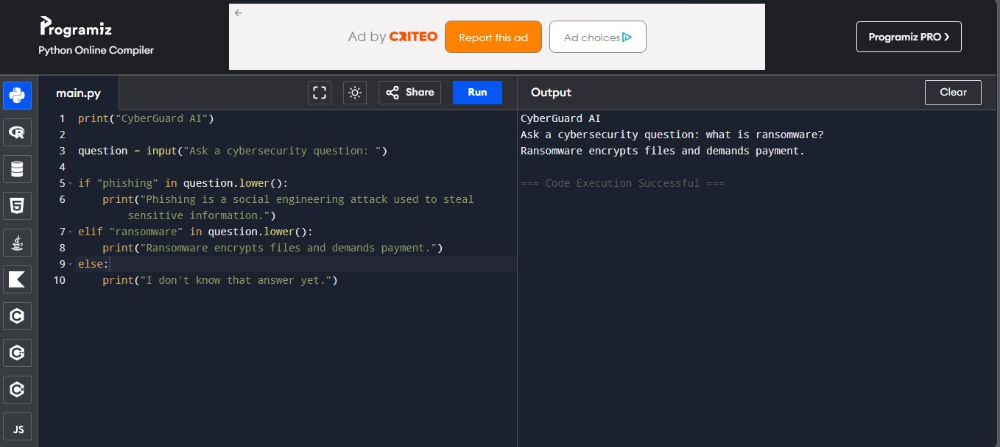
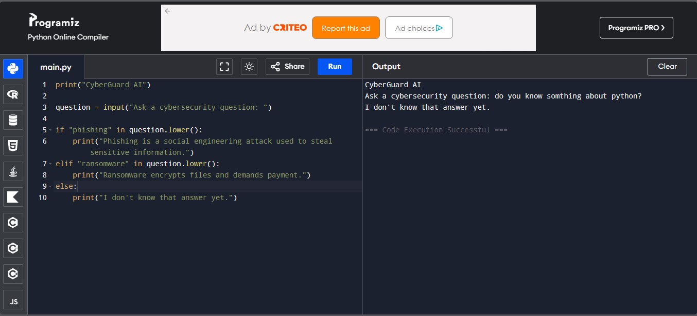

# CyberGuard AI

Simple cybersecurity chatbot written in Python.

## Features

- Python
- Cybersecurity basics
- Simple question answering

## Example

Question:
What is phishing?

Answer:
Phishing is a social engineering attack used to steal sensitive information.

## Screenshots

## Screenshot

### example-1

### example-2

### example-3

